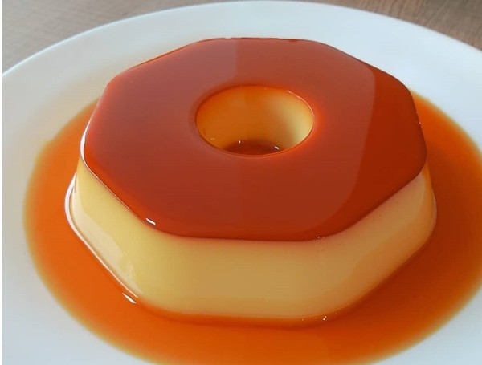
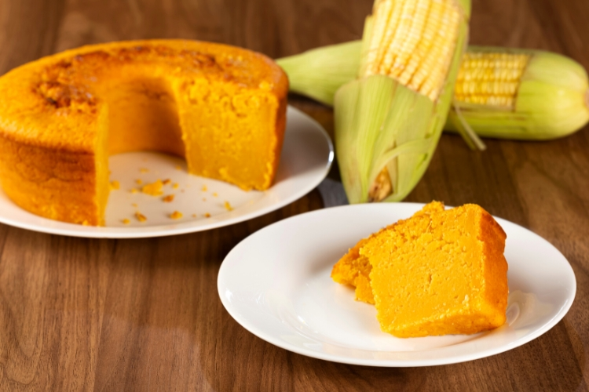

# exercicio1
PROGRAMAÇÃOPARA INTERNET EMFRONT-END<!DOCTYPE html>
<html lang="en">
  <head>
    <meta charset="UTF-8" />
    <meta http-equiv="X-UA-Compatible" content="IE=edge" />
    <meta name="viewport" content="width=device-width, initial-scale=1.0" />
    <title>Livro de receitas</title>
    <link
      href="https://cdn.jsdelivr.net/npm/bootstrap@5.1.3/dist/css/bootstrap.min.css"
      rel="stylesheet"
    />
    <link rel="stylesheet" href="styles.css" />
    
  </head>
  <body>
    
    

      

        <h2>Receita 1</h2>
        
        

          1 lata de leite condensado 1 lata de leite (medida da lata de leite
          condensado) 3 ovos inteiros. Derreta o açúcar na panela até ficar
          moreno, acrescente a água e deixe engrossar. Coloque em uma forma
          redonda e despeje a massa do pudim por cima. Asse em forno médio por
          45 minutos, com a assadeira redonda dentro de uma maior com água.
          Espete um garfo para ver se está bem assado.
        

      

      

        <h2>Receita 2</h2>
        
        

            500 g de peito de frango sem pele
            1/2 litro de caldo de galinha
            4 colheres (sopa) de óleo
            1 dente de alho amassado
            1 cebola picada
            3 tomates sem pele e sem sementes
            1 xícara (chá) de ervilhas
            sal e pimenta-do-reino a gosto
            MASSA
            250 ml de leite
            3/4 de xícara (chá) de óleo
            2 ovos
            1 e 1/2 xícara (chá) de farinha de trigo
            sal a gosto
            1 colher (sopa) de fermento em pó
            queijo ralado a gosto Cozinhe o peito de frango no caldo até ficar macio.
            Separe 1 xícara (chá) de caldo do cozimento e reserve.
            Refogue os demais ingredientes e acrescente as ervilhas por último.
            Desfie o frango, misture ao caldo e deixe cozinhar até secar.
            
        

      

      

        <h2>Receita 3</h2>
        
        

            1 lata de milho (sem o líquido)
            1 lata de leite (medida da lata de milho)
            1 lata de açúcar (medida da lata de milho)
            1 lata de flocão de milho
            1/2 lata de óleo de soja
            3 ovos inteiros
            1 colher (sopa) de fermento em pó
            margarina
            farinha de trigo
            Bata o leite, o óleo e os ovos no liquidificador em velocidade baixa.
            Acrescente aos poucos a farinha, o sal e o fermento.
            Despeje metade da massa em uma forma untada e adicione o recheio sobre ela.
            Cubra com o restante de massa e o queijo ralado.
            Leve ao forno preaquecido (180° C) até dourar.
      

    

    <ul class="pagination">
      <li class="page-item active"><a class="page-link" href="#">1</a></li>
      <li class="page-item"><a class="page-link" href="#">2</a></li>
      <li class="page-item"><a class="page-link" href="#">3</a></li>
    </ul>
    
  </body>
</html>
